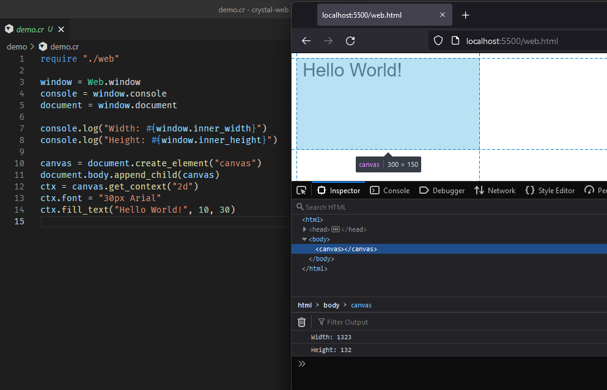

# crystal-web

This is an early proof of concept. It demonstrates that it is possible to develop Web front-end applications using Crystal. This library exposes the DOM and other browser JavaScript API's.



## Installation

1. Add the dependency to your `shard.yml`:

   ```yaml
   dependencies:
     web:
       github: lbguilherme/crystal-web
   ```

2. Run `shards install`

## Usage

There are several steps required to get the demo working for you. Here is the guide:

1. Build the Crystal compiler from source, from PR [#10870](https://github.com/crystal-lang/crystal/pull/10870).

    ```sh
    git clone https://github.com/lbguilherme/crystal.git
    cd crystal
    git checkout feat/webassembly
    make
    cd ..
    ```

2. Build your code with this compiler, targetting:

    ```sh
    crystal/bin/crystal build demo.cr --cross-compile --target wasm32-unknown-wasi
    ```

    This will produce two files: a `demo.wasm` and a `web.js`.

3. Grab some prebuilt dependencies:

    - libc: https://github.com/WebAssembly/wasi-sdk/releases/download/wasi-sdk-14/wasi-sysroot-14.0.tar.gz
    - compiler_rt: https://github.com/WebAssembly/wasi-sdk/releases/download/wasi-sdk-14/libclang_rt.builtins-wasm32-wasi-14.0.tar.gz
    - libpcre: https://github.com/lbguilherme/crystal/files/7791111/libpcre-8.45.tar.gz

4. Link your final WebAssembly binary:

    ```sh
    wasm-ld demo.wasm -o demo-final.wasm libc.a libclang_rt.builtins-wasm32.a libpcre.a --import-undefined --no-entry --export __original_main
    ```

    If you don't have `wasm-ld`, install the "lld" or "llvm-lld" packages. https://lld.llvm.org/WebAssembly.html.

5. Create a HTML file:

    ```html
    <script src="web.js"></script>
    <script>runCrystalApp("demo-final.wasm")</script>
    ```

6. Start a WebServer:

    ```html
    python3 -mhttp.server
    ```

7. Open your browser at http://localhost:8000 and enjoy.

## Creating an optimized build

The previous steps create an unoptimized debug build. To optimize it (for speed/size) you need:

1. Compile in release mode:

    ```sh
    crystal/bin/crystal build --release demo.cr --cross-compile --target wasm32-unknown-wasi
    ```

2. Link removing debug symbols and compressing sections:

    ```sh
    wasm-ld demo.wasm -o demo-final.wasm libc.a libclang_rt.builtins-wasm32.a libpcre.a --import-undefined --no-entry --export __original_main --strip-all --compress-relocations
    ```

3. Optimize with `wasm-opt`. Install it from Binaryen (https://github.com/WebAssembly/binaryen):

    ```sh
    wasm-opt demo-final.wasm -o demo-opt.wasm -O3 --converge
    ```

4. Use `demo-opt.wasm` instead of `demo-final.wasm`. It will work the same, but in case of errors, no useful stacktrace will be printed.

## Contributors

- [Guilherme Bernal](https://github.com/lbguilherme) - creator and maintainer
