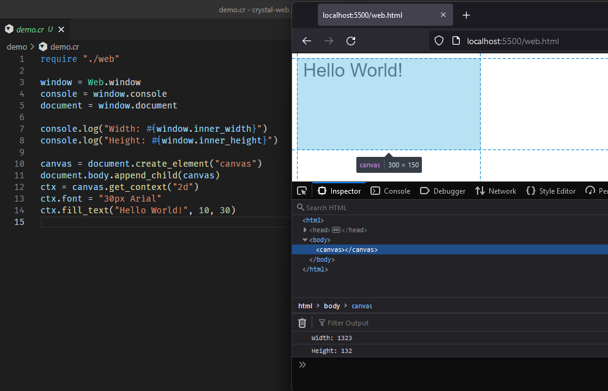

# crystal-web

This is an early proof of concept. It demonstrates that it is possible to develop Web front-end applications using Crystal. This library exposes the DOM and other browser JavaScript API's.



## Installation

1. Add the dependency to your `shard.yml`:

   ```yaml
   dependencies:
     web:
       github: lbguilherme/crystal-web
   ```

2. Run `shards install`

3. Build your project with `lib/web/scripts/build.sh src/main.cr`

See [crystal-web-demo](https://github.com/lbguilherme/crystal-web-demo) for an example project.

## Usage

For basic usage you can `require "web"` and then use DOM related classes and methods. The global `window` object will be accessible at `Web.window`.

```crystal
require "web"

Web.window.console.log("Hello from the Web!")
```

You can define special methods that run JavaScript code from Crystal. They can take parameters but their body must be a single string literal using interpolation to receive arguments:

```crystal
require "web"

module Test
  # You need to include this module. It won't add any new methods, all it will do
  # is expanding JavaScript methods you define.
  include JavaScript::ExpandMethods

  # Mark JavaScript methods with this annotation. They must be fully typed and
  # be aware that not all types are supported yet.
  @[JavaScript::Method]
  def self.add(first : Int32, second : Int32) : Int32
    # This is NOT a raw string interpolation. The notation here is used to pass
    # valid values to JavaScript land.
    <<-js
      return #{first} + #{second}; // This is JavaScript!
    js
  end
end

five = Test.add(2, 3) # Returns 5.
```

More complex examples can be created using `JavaScript::Reference`, an abstract base class capable of holding references to JavaScript values.

```crystal
require "web"

class MyObj < JavaScript::Reference
  @[JavaScript::Method]
  def self.new(data : String) : MyObj
    <<-js
      const pieces = #{data}.split(', ')
      return {
        pieces,
        length: pieces.length
      };
    js
  end

  @[JavaScript::Method]
  def size : Int32
    <<-js
      return #{self}.length;
    js
  end

  @[JavaScript::Method]
  def add_piece(piece : String)
    <<-js
      #{self}.pieces.push(#{piece.strip.as(String)}); // You can use complex Crystal expressions,
      #{self}.length += 1;                            // as long as you add `.as(type)` to it.
    js
  end
end

obj = MyObj.new("a, b, c")
p obj.size # => 3
obj.add_piece("d")
p obj.size # => 4
```

Only the methods that are actually called will be generated in the output `web.js` file, thus it is fine to define usused methods.

## Building your project

You can use `shards install` and then build with `lib/web/scripts/build.sh src/main.cr`. Use the `--release` flag for an optimized build.

Alternatively, you can use the following steps to do the same thing manually:

1. Build the Crystal compiler from source.

    ```sh
    git clone https://github.com/crystal-lang/crystal.git crystal-wasm
    make -C crystal-wasm
    ```

2. Build your code with this compiler, targetting:

    ```sh
    crystal-wasm/bin/crystal build demo.cr --cross-compile --target wasm32-unknown-wasi
    ```

    This will produce two files: a `demo.wasm` and a `web.js`.

3. Grab some prebuilt dependencies:

    - libc: https://github.com/WebAssembly/wasi-sdk/releases/download/wasi-sdk-14/wasi-sysroot-14.0.tar.gz
    - compiler_rt: https://github.com/WebAssembly/wasi-sdk/releases/download/wasi-sdk-14/libclang_rt.builtins-wasm32-wasi-14.0.tar.gz
    - libpcre: https://github.com/lbguilherme/crystal/files/7791111/libpcre-8.45.tar.gz

4. Link your final WebAssembly binary:

    ```sh
    wasm-ld demo.wasm -o demo-final.wasm libc.a libclang_rt.builtins-wasm32.a libpcre.a --import-undefined --no-entry --export __original_main --export __js_bridge_malloc_atomic --export __js_bridge_malloc --export __js_bridge_get_type_id
    ```

    If you don't have `wasm-ld`, install the "lld" or "llvm-lld" packages. https://lld.llvm.org/WebAssembly.html.

5. Create a HTML file:

    ```html
    <script src="web.js"></script>
    <script>runCrystalApp("demo-final.wasm")</script>
    ```

6. Start a WebServer:

    ```sh
    python3 -mhttp.server
    ```

7. Open your browser at http://localhost:8000 and enjoy.

### Creating an optimized build

The previous steps create an unoptimized debug build. To optimize it (for speed/size) you need:

1. Compile in release mode:

    ```sh
    crystal-wasm/bin/crystal build --release demo.cr --cross-compile --target wasm32-unknown-wasi
    ```

2. Link removing debug symbols and compressing sections:

    ```sh
    wasm-ld demo.wasm -o demo-final.wasm libc.a libclang_rt.builtins-wasm32.a libpcre.a --import-undefined --no-entry --export __crystal_main --strip-all --compress-relocations
    ```

3. Optimize with `wasm-opt`. Install it from Binaryen (https://github.com/WebAssembly/binaryen):

    ```sh
    wasm-opt demo-final.wasm -o demo-opt.wasm -O3 --converge
    ```

4. Use `demo-opt.wasm` instead of `demo-final.wasm`. It will work the same, but in case of errors, no useful stacktrace will be printed.

## How to contribute?

- Help defining more standard DOM interfaces at `src/web/dom.cr` (good start)
- Build cool demos and examples with this library (awesome)
- Support more types for the bridge at `src/web/bridge.cr` (complex)
- Identify, report and/or fix bugs
